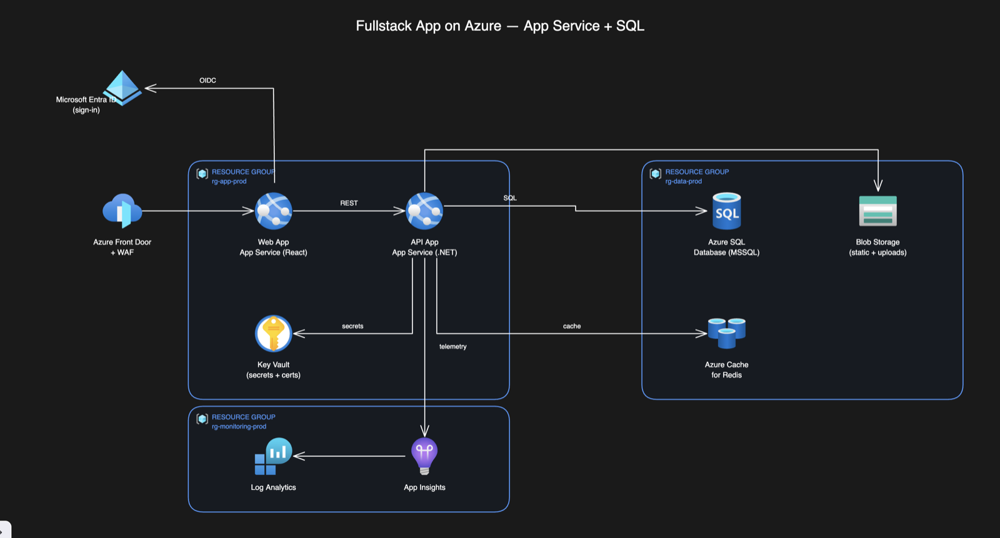

# azure-diagram

Create clean **Azure cloud architecture diagrams** as `.excalidraw` files — the modern
Microsoft-docs look: dark canvas, official Azure service icons as nodes, white orthogonal
connectors, and resource-group containers. Diagrams are fully editable in Excalidraw
(icons + captions grouped, arrows snapped to nodes, resource groups move as a unit).

*Generated by the skill from a one-line request. Open the saved `.excalidraw` in
[excalidraw.com](https://excalidraw.com) or the VS Code Excalidraw extension.*

## Try it

In Claude Code (with this skill installed), just describe the architecture:

> **"Diagram a fullstack app on Azure using App Service and MSSQL, with resource groups."**

Other prompts that trigger it:

> "Draw the Azure architecture for an event-driven order pipeline — Front Door, API
> Management, Service Bus, Functions, Cosmos DB, with an observability resource group."

> "/azure-diagram a hub-and-spoke integration: API Management in the middle, Service Bus,
> Functions, Azure SQL and Key Vault as spokes."

> "Visualise a RAG app on Azure — Front Door → Web → API Management → Cognitive Search →
> Blob + DevOps repos, plus Azure OpenAI → Functions → Redis."

The skill picks the right Azure icons (647 official ones bundled — `azdiagram.py icons <query>`
to search), lays everything out, routes the connectors around other icons, and saves a
`.excalidraw` file to your Desktop by default.

## How it works

Under the hood the skill hands a compact **scene** (nodes on a grid, panels, edges) to a
bundled pure-Python generator that computes all the geometry. See
[SKILL.md](SKILL.md) for the workflow and [reference/azure-catalog.md](reference/azure-catalog.md)
for the scene schema and design system. Nothing to install — it's stdlib-only.

## Install

See the [collection README](../../../README.md#quick-start): `./scripts/link.sh` (repo) or
`--global`, then it's available in any project. On opencode, use the
[opencode copy](../../../opencode/skills/azure-diagram/) — same generator, file-only output.
