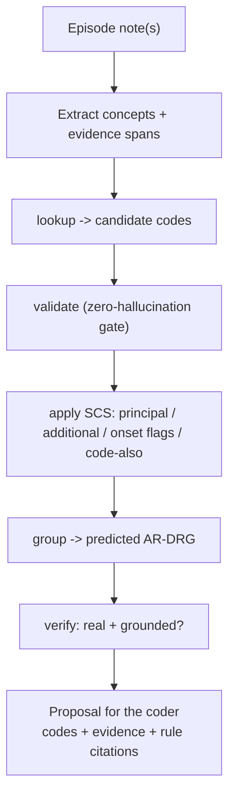

# clin-coder

Agentic **clinical coding** on synthetic data. Give it a patient episode (discharge summary, op notes,
pathology, progress notes) and it proposes the codes — **principal + additional diagnoses with
condition-onset flags, procedures, and a predicted AR-DRG** — each grounded to *a sentence in the note*
and *the coding-standard rule* behind it, for a human coder to review.

> **Synthetic and advisory only.** The bundled code set (**SCC**) and standards (**SCS**) are fictional —
> NOT ICD-10-AM/ACHI/ACS (copyright IHACPA), and NOT medical/coding advice. The output is a proposal for a
> qualified human coder, never an automated billing/funding decision.

## Try it

In Claude Code with this skill installed:

> **"/clin-coder — code the example episode EP-0002."**

Other prompts that trigger it:

> "Code this discharge summary." *(paste or point at a note)*

> "What's the principal diagnosis and DRG for this episode, with the coding rules that justify each code?"

## How it works

The core idea: **the model decides _what the episode says_; a deterministic Python helper keeps _codes
real and grouping deterministic_.** The model extracts concepts and reasons about the standards, but every
code is validated against the loaded code set before it's emitted — so the agent can't hallucinate a code.

`scripts/ccagent.py` (stdlib only, self-locating) provides the deterministic tools:
`catalog · codes · lookup · validate · group · verify · check · example`.

## What's bundled

- **`reference/`** — the SCC code set + SCS coding standards.
- **`assets/examples/`** — 3 fictional episodes + gold codings, seeded with the hard cases coders actually
  hit: an additional diagnosis that *fails* the SCS-0002 criteria (distractor), a symptom that must not be
  the principal diagnosis, hospital-acquired condition-onset flags, and `code_also` chains.
- **`scripts/ccagent.py`** — the tools, plus a `check` command that scores a proposal against a gold coding
  (precision/recall/F1, principal-dx match, DRG match, hallucinated-code count, groundedness).

## Companion subagents

Ships with two optional read-only subagents in this collection: **`clin-coder-concept-extractor`** (parallel,
per-document concept extraction) and **`clin-coder-verifier`** (an auditor that can't modify the proposal).
The skill uses them if present and does the work inline otherwise.

## Install

See the [collection README](../../../README.md#quick-start): `./scripts/link.sh` (repo) or `--global`.
Nothing else to install — the helper is stdlib-only Python.
