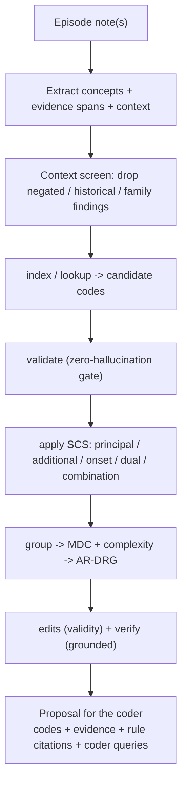

# clin-coder

Agentic **clinical coding** on synthetic data.

## What it is
A Claude Code **skill** that reads a patient's episode documentation (discharge summary, operation notes,
pathology, progress notes) and proposes the clinical codes for it — the **principal diagnosis**,
**additional diagnoses** (each with a condition-onset flag), **procedures**, and a predicted **funding
group (AR-DRG)**.

## What it's for
Clinical coding is slow, high-skill, backlog-prone work, and mistakes cost real money (under-coding loses
funding; over-coding is a compliance risk). This skill is a **decision-support assistant for a qualified
coder**: it does the first pass — reading, mapping, applying the standards, grouping — and hands back a
proposal where **every code is tied to a sentence in the note and the rule that justifies it**, so the
coder can review, edit, and approve quickly and defensibly. It never invents a code, and it flags what it
can't code confidently instead of guessing.

> **Synthetic and advisory only.** The bundled code set (**SCC**) and standards (**SCS**) are fictional —
> NOT ICD-10-AM/ACHI/ACS (copyright IHACPA), and NOT medical/coding advice. Output is always a proposal
> for a human coder, never an automated billing/funding decision.

## What it is *not*
Not a production coder and not a substitute for a certified clinical coder. It does not contain the real
classifications or a licensed grouper, does not read real medical records (no EMR/PAS integration, OCR, or
de-identification), and has not been evaluated on real coder-validated data. See **Scope** below.

## How it works
The core idea: **the model decides _what the episode says_; a deterministic Python engine keeps _codes
real, edits enforced, and grouping deterministic_.** The model reads and reasons; every code is validated
against the loaded code set before it's emitted, so it can't hallucinate a code.

`scripts/ccagent.py` (stdlib only, self-locating) is the engine:
`catalog · codes · index · lookup · context · validate · edits · group · verify · check · eval · example`.

### What it can do
- **Clinical-context screening** — negation, uncertainty, history, and family-history detection so
  negated/historical/family findings are excluded (the #1 over-coding trap).
- **Alphabetic-index navigation** (lead term → code), not just fuzzy search.
- **Standards** — principal (SCS-0001), additional-dx criteria (SCS-0002), symptom-vs-definitive
  (SCS-SEQ-01), condition-onset flags, dagger/asterisk dual coding, morphology, and combination codes.
- **Validity edits** — unacceptable principal, sex conflicts, `excludes` clashes, missing `code_also`,
  dagger/asterisk pairing, combination supersession, morphology.
- **Mock grouper** — MDC + a complexity split (A/B/C) driven by additional-dx severity and onset flags.
- **Evaluation harness** — score a proposal against gold, or run a batch scoreboard
  (precision/recall/F1, principal-dx accuracy, DRG match, hallucination rate, groundedness, withholding).

## Try it

In Claude Code with this skill installed:

> **"/clin-coder — code the example episode EP-0004."** *(a negation + family-history case)*

> "Code this discharge summary." *(paste or point at a note)*

> "Run the clin-coder eval and show me the scoreboard."

## What's bundled
- `reference/` — the SCC code set + SCS standards + alphabetic index.
- `assets/examples/` — **6 episodes + gold codings** covering the hard cases (SCS-0002 distractor,
  symptom-vs-definitive, hospital-acquired onset flags, code-also chains, **negation + family history**,
  **uncertain-but-treated**, and a **neoplasm + morphology + procedure**), plus `sample-proposals/`
  (one perfect, two with deliberate errors) so `ccagent.py eval` produces a live scoreboard.

## Companion subagents (this collection)
- **`clin-coder-concept-extractor`** — read-only, per-document, parallel concept extraction with context flags.
- **`clin-coder-verifier`** — read-only auditor (runs `edits`/`verify`); can't modify the proposal.
- **`clin-coder-cdi`** — read-only; drafts a non-leading documentation-improvement query when the note is too thin.
The skill uses them if present and does the work inline otherwise.

## Scope
A **demonstration on synthetic data**, deliberately excluding: real ICD-10-AM/ACHI/ACS and a licensed
AR-DRG grouper (IHACPA licensing); EMR/PAS integration; OCR / real-document ingestion + de-identification;
and a coder-validated evaluation. Those belong to a separate, governed build.

## Install
See the [collection README](../../../README.md#quick-start): `./scripts/link.sh` (repo) or `--global`.
Nothing to install — the engine is stdlib-only Python.
