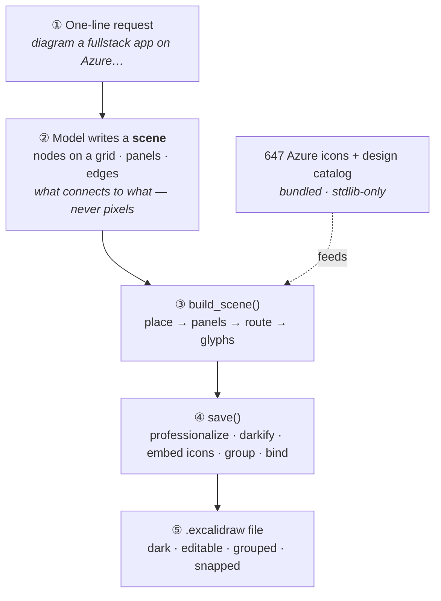

# azure-diagram

Create clean **Azure cloud architecture diagrams** as `.excalidraw` files — the modern
Microsoft-docs look: dark canvas, official Azure service icons as nodes, white orthogonal
connectors, and resource-group containers. Diagrams are fully editable in Excalidraw
(icons + captions grouped, arrows snapped to nodes, resource groups move as a unit).

*Generated by the skill from a one-line request. Open the saved `.excalidraw` in
[excalidraw.com](https://excalidraw.com) or the VS Code Excalidraw extension.*

## Try it

In opencode (with this skill installed), just describe the architecture and the agent loads
the skill:

> **"Diagram a fullstack app on Azure using App Service and MSSQL, with resource groups."**

Other prompts that trigger it:

> "Draw the Azure architecture for an event-driven order pipeline — Front Door, API
> Management, Service Bus, Functions, Cosmos DB, with an observability resource group."

> "Visualise a RAG app on Azure — Front Door → Web → API Management → Cognitive Search →
> Blob + DevOps repos, plus Azure OpenAI → Functions → Redis."

The skill picks the right Azure icons (647 official ones bundled — `azdiagram.py icons <query>`
to search), lays everything out, routes the connectors around other icons, and saves a
`.excalidraw` file to your Desktop by default. opencode is **file-only** (no inline render) —
open the saved file in [excalidraw.com](https://excalidraw.com) or VS Code.

## How it works

The core idea: **the model decides _what connects to what_; a deterministic Python generator
decides _where everything goes_.** A language model is good at intent but unreliable at
pixel-level layout — so it only ever writes a compact *scene*, and `scripts/azdiagram.py`
computes the geometry, routes the connectors, and bakes the `.excalidraw` file.

**The pipeline**

1. **Request** — you describe the architecture in plain language; the agent loads the skill.
2. **Compose** — the agent reads `SKILL.md` + the catalog, searches the icon set, and emits a
   declarative *scene*: `{ title, grid, nodes[], panels[], edges[] }`. No coordinates.
3. **Build — `build_scene()`** — *place* grid cells → pixel centres · *panels* auto-fit their
   members and add the resource-group chip · *route* an obstacle-aware orthogonal router fans
   edges into anchor slots and picks a path that crosses **no icon or caption** · *glyphs* icon +
   caption grouped as one, nested inside the panel.
4. **Save — `save()`** — professionalize (clean strokes / Helvetica) · darkify (dark canvas,
   white ink) · embed each icon as a base64 SVG · assign group ids (innermost-first) · **bind
   arrows to nodes** with `boundElements` back-refs, so they snap and follow when you drag a node.
5. **Output** — a real `.excalidraw` file on your Desktop. opencode is file-only — open it in
   [excalidraw.com](https://excalidraw.com) or the VS Code Excalidraw extension.

Everything is stdlib-only and self-locates its bundled assets, so the identical engine runs on
both opencode and Claude Code. See [SKILL.md](SKILL.md) and
[reference/azure-catalog.md](reference/azure-catalog.md) for the full scene schema and design
system. Nothing to install.

## Install

See the [collection README](../../../README.md#quick-start): `./scripts/link.sh` (repo) or
`--global`, then it's available in any project.
